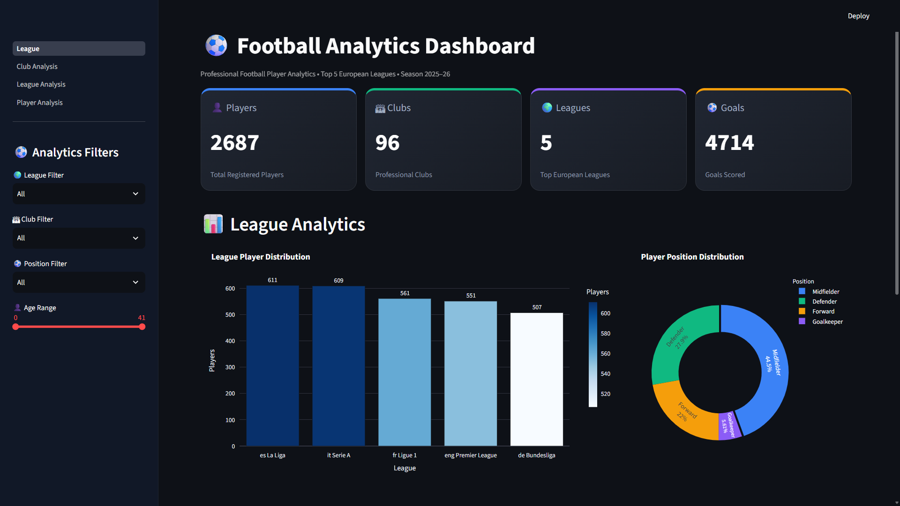
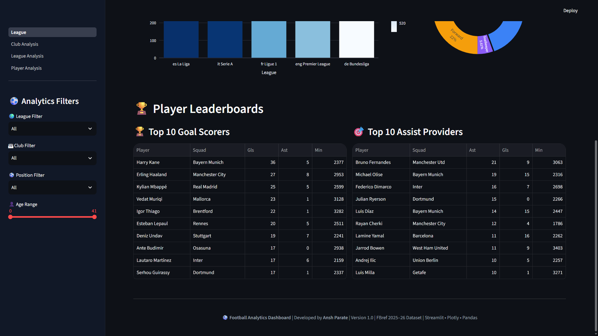
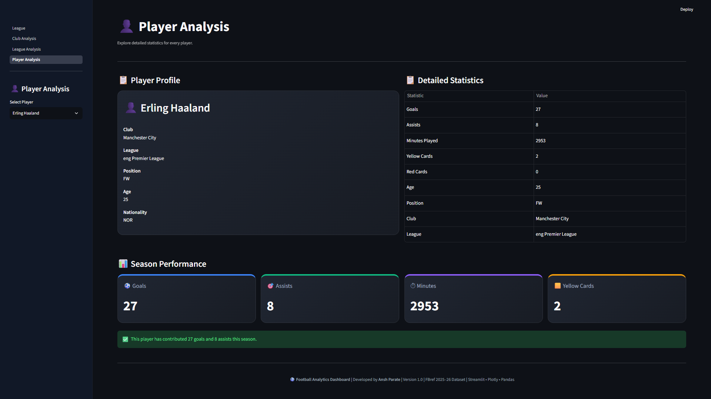
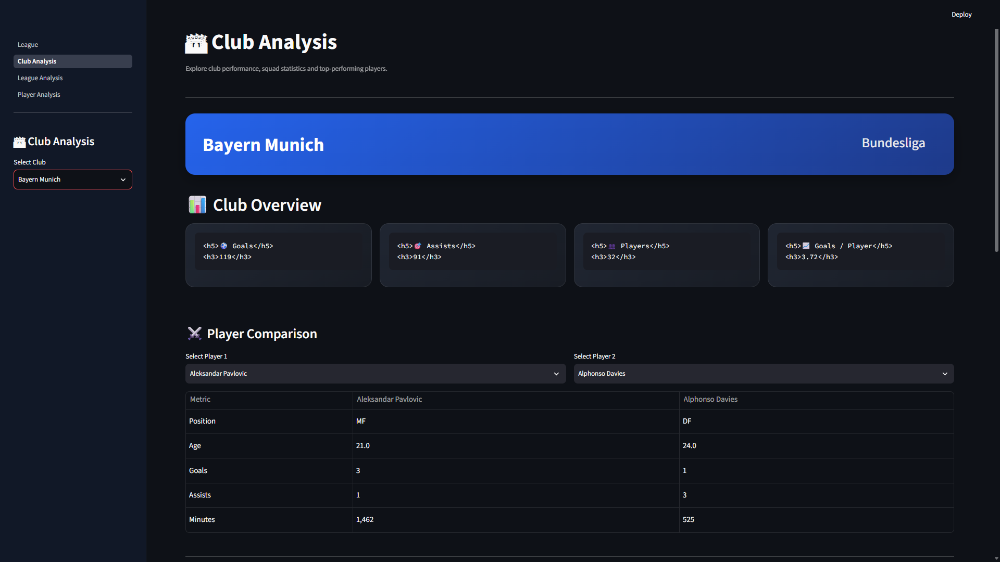
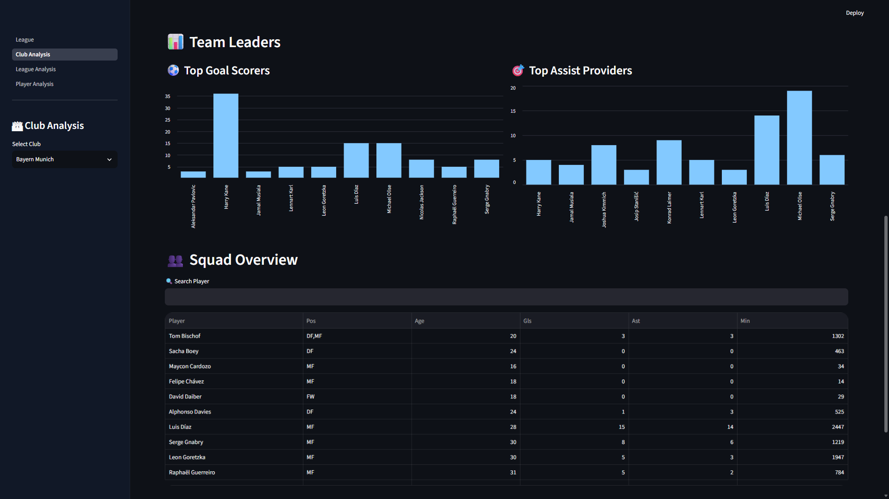
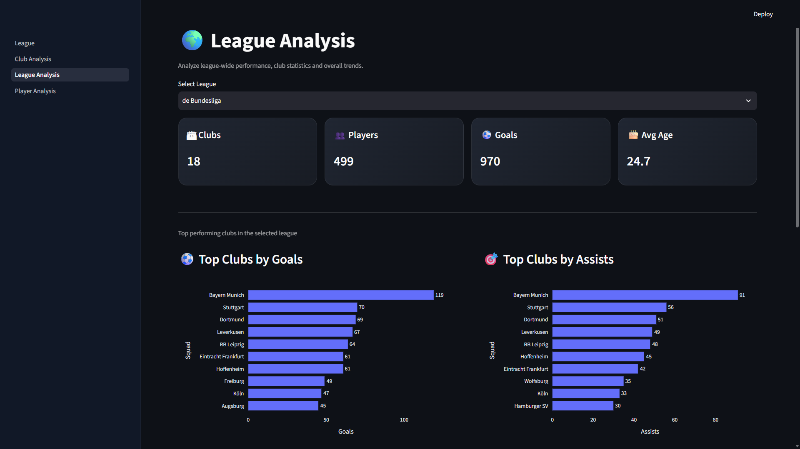
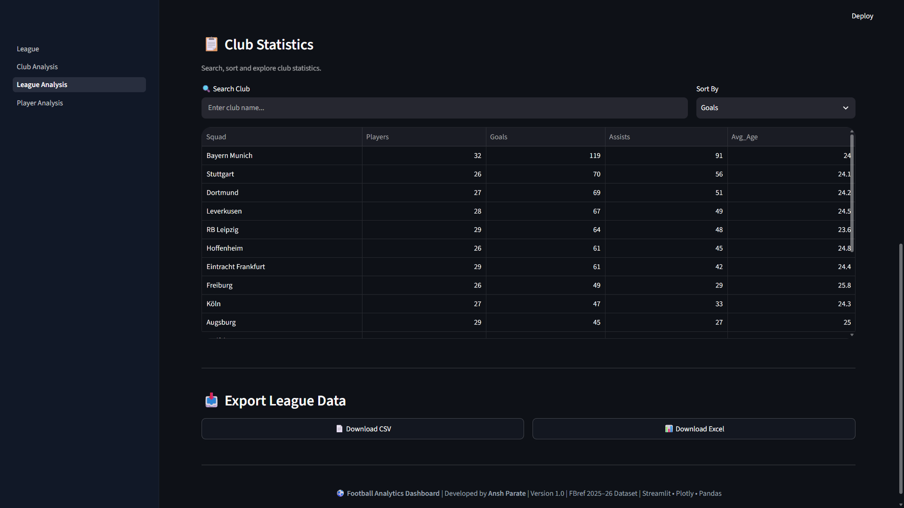

# ⚽ Football Analytics Dashboard


A professional **Football Analytics Dashboard** built using **Streamlit**, **Pandas**, and **Plotly** to analyze player, club, and league performance across Europe's top football leagues.

The dashboard provides interactive visualizations, advanced filtering, performance metrics, and export functionality, enabling users to explore football statistics through an intuitive web interface.

---

## 🚀 Live Demo

🌐 **Live Application:**  
https://football-player-dashboard-n9av8ypwzpeshny2e5uu6p.streamlit.app/

---

## 📚 Table of Contents

- [About the Project](#-about-the-project)
- [Features](#-features)
- [Project Structure](#-project-structure)
- [Dataset](#-dataset)
- [Technologies Used](#-technologies-used)
- [Installation](#-installation)
- [Dashboard Modules](#-dashboard-modules)
- [Future Enhancements](#-future-enhancements)
- [Author](#-author)
- [License](#-license)

---

## 🎯 About the Project

Football generates vast amounts of player and team statistics every season. This project provides an interactive analytics dashboard that helps users explore football performance data through dynamic filters, visualizations, and comparative analysis. It demonstrates practical data analytics, visualization, and dashboard development using Python and Streamlit.

## 🚀 Features

### 📊 Interactive Dashboard


- League-wide analytics
- Dynamic KPI cards
- Interactive Plotly charts
- Responsive user interface

### 👤 Player Analysis

- Player performance statistics
- Player comparison
- Goals and assists analysis
- Detailed player information

### 🏟 Club Analysis


- Club performance overview
- Squad statistics
- Team leaderboards
- Club comparison

### 🌍 League Analysis


- League statistics
- Club rankings
- Position distribution
- Performance comparison across leagues

### 🔍 Dynamic Filters
- League Filter
- Club Filter
- Position Filter
- Age Filter

### 📁 Export Options
- Export player data to CSV
- Export club statistics to Excel


# 🗂 Project Structure

```text
Football-Player-Dashboard/

│
├── League.py
│
├── data/
│   └── cleaned_players.csv
│
├── pages/
│   ├── Player_Analysis.py
│   ├── Club_Analysis.py
│   └── League_Analysis.py
│
├── utils/
│   ├── charts.py
│   ├── data_loader.py
│   ├── metrics.py
│   └── styles.py
│
├── assets/
│   └── styles.css
│
├── requirements.txt
├── README.md
└── LICENSE
```

---

## 📂 Dataset

This dashboard uses football player statistics from the **FBref 2025–26 Season Dataset**.

The dataset includes:

- Player Information
- Club Information
- League Information
- Position
- Age
- Goals
- Assists
- Minutes Played
- Matches Played

---

# 🛠 Technologies Used

| Technology | Purpose |
|------------|---------|
| Python | Programming Language |
| Streamlit | Dashboard Framework |
| Pandas | Data Processing |
| Plotly | Interactive Visualizations |
| OpenPyXL | Excel Export |
| HTML/CSS | Custom Dashboard Styling |

---

## 📌 Project Statistics

- 📁 Modular Python Project
- 📊 4 Dashboard Pages
- 📈 Interactive Plotly Visualizations
- 📂 CSV & Excel Export
- 🎨 Custom CSS Styling
- ✅ Flake8 Compliant
- 🌐 Live Streamlit Deployment

---

# ⚙ Installation

Clone the repository

```bash
git clone https://github.com/AnshParate05/Football-Player-Dashboard.git
```

Navigate to the project

```bash
cd Football-Player-Dashboard
```

Create virtual environment

```bash
python -m venv venv
```

Activate virtual environment

Windows

```bash
venv\Scripts\activate
```

Linux / macOS

```bash
source venv/bin/activate
```

Install dependencies

```bash
pip install -r requirements.txt
```

Run the dashboard

```bash
streamlit run League.py
```

---

# 📈 Dashboard Modules

## Home Dashboard

- KPI Cards
- League Analytics
- Position Distribution
- Player Leaderboards

---

## Player Analysis

- Player Search
- Player Statistics
- Performance Comparison
- Export Player Data

---

## Club Analysis

- Club Overview
- Squad Statistics
- Team Leaderboards
- Export Club Data

---

## League Analysis

- League Overview
- Club Rankings
- Performance Metrics
- Comparative Charts

---

# 📊 Key Highlights

✔ Interactive Analytics Dashboard

✔ Dynamic Data Filtering

✔ Plotly Visualizations

✔ Modular Project Structure

✔ CSV & Excel Export

✔ Responsive Design

✔ Professional UI

✔ Clean & Organized Code

✔ Flake8 Compliant

---

# 📌 Future Enhancements

Future versions of this project aim to integrate machine learning capabilities, including:

- Player Performance Prediction
- Player Market Value Estimation
- Player Similarity Recommendation
- Injury Risk Prediction
- Expected Goals (xG) Analysis
- Predictive Analytics Dashboard

---

# 🎯 Project Roadmap

FBref Dataset
        │
        ▼
Data Cleaning
        │
        ▼
Interactive Dashboard ✅
        │
        ▼
Advanced Analytics ✅
        │
        ▼
Machine Learning 🔄
        │
        ▼
Prediction Engine
        │
        ▼
Recommendation System

---

# 💻 Code Quality

This project follows good software engineering practices.

- Modular Architecture
- Reusable Components
- Organized Folder Structure
- PEP8 Coding Standards
- Flake8 Compliant

---

# 🤝 Contributing

Contributions are welcome.

If you would like to improve this project:

1. Fork the repository
2. Create a new branch
3. Commit your changes
4. Open a Pull Request

---

# 👨‍💻 Author

**Ansh Parate**

Computer Science & Engineering Student

GitHub: https://github.com/AnshParate05

---

# 📄 License

This project is licensed under the MIT License.

---

## ⭐ Acknowledgements

This project was developed as part of my learning journey in Data Analytics and Dashboard Development. Future versions will expand the platform with machine learning models for predictive football analytics.

If you found this project useful, consider giving it a ⭐ on GitHub.